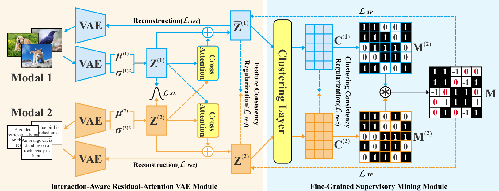

# RATP

The code for **"Reliable Cross-Modal Clustering via Interaction-Aware Representation and
Fine-Grained Supervisory Mining"**

## Framewrok

Architecturally, our RATP framework is as follows:

    

## Environment

python ==3.8

pytorch==2.4.1

If you want to run the code, you first need to create a python 3.8 environment with PyTorch 2.4.1.

## Requirements

Install the dependencies in requirements.txt.

## Run

You can run the code as follows:

```
python main.py
```

## Dataset

The MIRFlickr dataset is given as an example, if you want to run your own datasets, you can add the datasets in the data folder and modify the corresponding configuration.